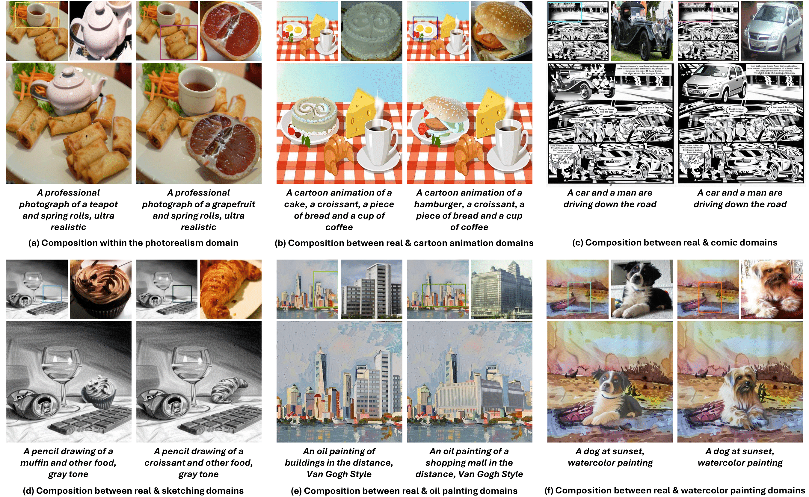
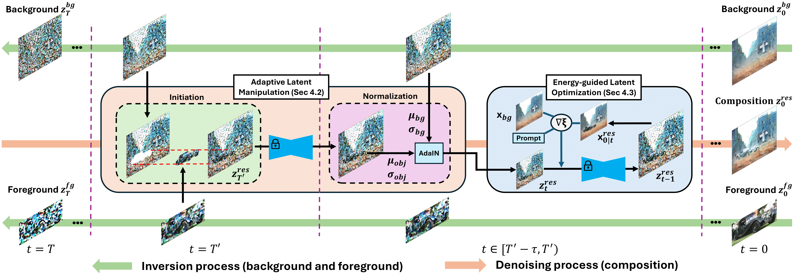

<div align="center">
<h2><font color="red"> TALE </font></center> <br> <center>Training-free Cross-domain Image Composition via
Adaptive Latent Manipulation and Energy-guided Optimization</h2>

[Kien T. Pham](https://tkpham3105.github.io/), [Jingye Chen](https://jingyechen.github.io/), [Qifeng Chen](https://cqf.io)

<a href='https://doi.org/10.1145/3664647.3681079'></a> <a href='https://arxiv.org/abs/2408.03637'></a> <a href='https://tkpham3105.github.io/tale/'></a>   [](https://github.com/tkpham3105/TALE)
</div>

Official implementation of [TALE: Training-free Cross-domain Image Composition via Adaptive Latent Manipulation and Energy-guided Optimization](https://doi.org/10.1145/3664647.3681079).

>**Abstract**:
We present TALE, a novel training-free framework harnessing the generative capabilities of text-to-image diffusion models to address the cross-domain image composition task that focuses on flawlessly incorporating user-specified objects into a designated visual contexts regardless of domain disparity. Previous methods often involve either training auxiliary networks or finetuning diffusion models on customized datasets, which are expensive and may undermine the robust textual and visual priors of pre-trained diffusion models. Some recent works attempt to break the barrier by proposing training-free workarounds that rely on manipulating attention maps to tame the denoising process implicitly. However, composing via attention maps does not necessarily yield desired compositional outcomes. These approaches could only retain some semantic information and usually fall short in preserving identity characteristics of input objects or exhibit limited background-object style adaptation in generated images. In contrast, TALE is a novel method that operates directly on latent space to provide explicit and effective guidance for the composition process to resolve these problems. Specifically, we equip TALE with two mechanisms dubbed Adaptive Latent Manipulation and Energy-guided Latent Optimization. The former formulates noisy latents conducive to initiating and steering the composition process by directly leveraging background and foreground latents at corresponding timesteps, and the latter exploits designated energy functions to further optimize intermediate latents conforming to specific conditions that complement the former to generate desired final results. Our experiments demonstrate that TALE surpasses prior baselines and attains state-of-the-art performance in image-guided composition across various photorealistic and artistic domains.
</div>





## ⚙️ Setup
Our codebase has two versions located on two different branches. Please refer to each branch for the respective environment settings. 
The main branch is built using [Diffusers](https://github.com/huggingface/diffusers) library for better efficiency, usability, and readability.
The original branch is built on [TF-ICON](https://github.com/Shilin-LU/TF-ICON) for reproducibility and slightly better performance.
A VRAM of 23 GB is recommended, though this may vary depending on the input samples (minimum 20 GB).

### Creating a Conda Environment
```
git clone https://github.com/tkpham3105/TALE.git
cd TALE
conda create --name tale python=3.10 -y
conda activate tale
pip install -r requirements.txt
```

## 🚀 Running TALE

### Data Preparation
Several input samples are provided under `./examples` directory. Each sample involves one background, one foreground, one segmentation mask for the foreground, and one user mask that denotes the desired composition location. The input data structure is as follow:
```
examples
├── prompt1
│  ├── background.png
│  ├── foreground.png
│  ├── segmentation.png
│  ├── location.png
├── prompt2
│  ├── ...
```

### Image Composition
To run our TALE framework, simply execute the main.py script while playing with its arguments. 
Note that we currently support using TALE with two diffusion pipelines: Stable Diffusion and PixArt-α. However, it can easily be adopted to other larger pipelines if GPUs permit.   

## 🖼 Gallery
We have showcased some results of cross-domain image composition using TALE below.

### Photorealism-Sketching cross-domain composition results.


### Photorealism-Oil painting cross-domain composition results.


### Photorealism same-domain composition results.


### Photorealism-Comic cross-domain composition results.


### Photorealism-Watercolor painting cross-domain composition results.


### Photorealism-Cartoon animation cross-domain composition results.


More results can be found on our [Project page](https://tkpham3105.github.io/tale/).

## ✏️ Acknowledgments
Our work is inspired thanks to the following contributors: [TF-ICON](https://github.com/Shilin-LU/TF-ICON), [FreeDoM](https://github.com/vvictoryuki/FreeDoM), [Stable-Diffusion](https://github.com/Stability-AI/stablediffusion), and [Prompt-to-Prompt](https://github.com/google/prompt-to-prompt).

## :herb: Citation
If you find this code useful in your research, please show your support by giving us a star ⭐️⭐️⭐️ and consider citing:
```
@article{
  pham2024tale,
  title={TALE: Training-free Cross-domain Image Composition via Adaptive Latent Manipulation and Energy-guided Optimization},
  author={Pham, Kien T and Chen, Jingye and Chen, Qifeng},
  journal={arXiv preprint arXiv:2408.03637},
  year={2024}
}

@inproceedings{10.1145/3664647.3681079,
  author = {Pham, Kien T. and Chen, Jingye and Chen, Qifeng},
  title = {TALE: Training-free Cross-domain Image Composition via Adaptive Latent Manipulation and Energy-guided Optimization},
  year = {2024},
  isbn = {9798400706868},
  publisher = {Association for Computing Machinery},
  address = {New York, NY, USA},
  url = {https://doi.org/10.1145/3664647.3681079},
  doi = {10.1145/3664647.3681079},
  abstract = {We present TALE, a novel training-free framework harnessing the generative capabilities of text-to-image diffusion models to address the cross-domain image composition task that focuses on flawlessly incorporating user-specified objects into a designated visual contexts regardless of domain disparity. Previous methods often involve either training auxiliary networks or finetuning diffusion models on customized datasets, which are expensive and may undermine the robust textual and visual priors of pre-trained diffusion models. Some recent works attempt to break the barrier by proposing training-free workarounds that rely on manipulating attention maps to tame the denoising process implicitly. However, composing via attention maps does not necessarily yield desired compositional outcomes. These approaches could only retain some semantic information and usually fall short in preserving identity characteristics of input objects or exhibit limited background-object style adaptation in generated images. In contrast, TALE is a novel method that operates directly on latent space to provide explicit and effective guidance for the composition process to resolve these problems. Specifically, we equip TALE with two mechanisms dubbed Adaptive Latent Manipulation and Energy-guided Latent Optimization. The former formulates noisy latents conducive to initiating and steering the composition process by directly leveraging background and foreground latents at corresponding timesteps, and the latter exploits designated energy functions to further optimize intermediate latents conforming to specific conditions that complement the former to generate desired final results. Our experiments demonstrate that TALE surpasses prior baselines and attains state-of-the-art performance in image-guided composition across various photorealistic and artistic domains.},
  booktitle = {Proceedings of the 32nd ACM International Conference on Multimedia},
  pages = {3160–3169},
  numpages = {10},
  keywords = {adaptive latent manipulation, cross-domain, diffusion models, energy-guided optimization, image composition, training-free},
  location = {Melbourne VIC, Australia},
  series = {MM '24}
}
```
